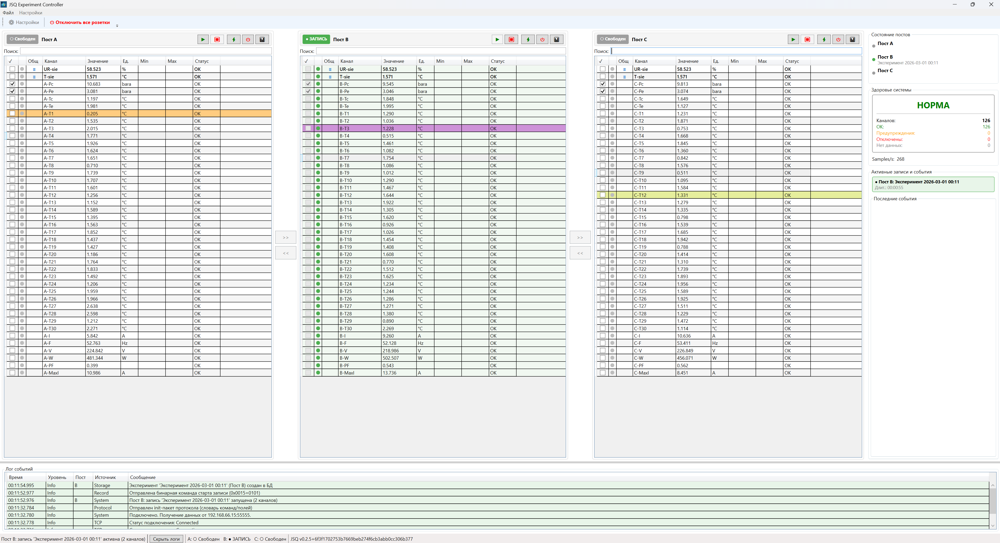
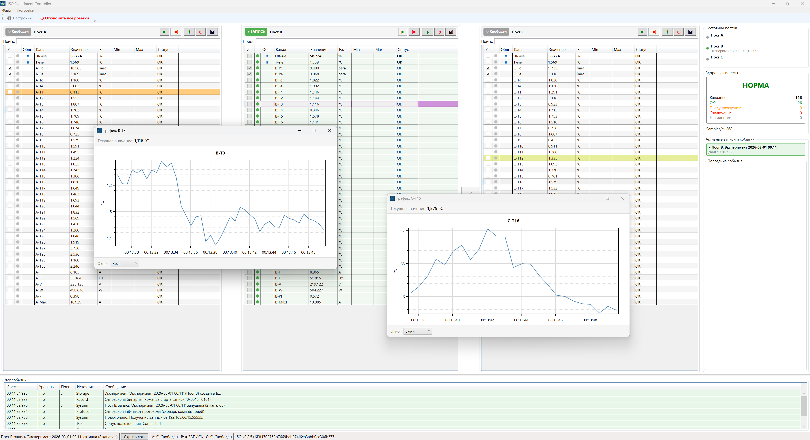
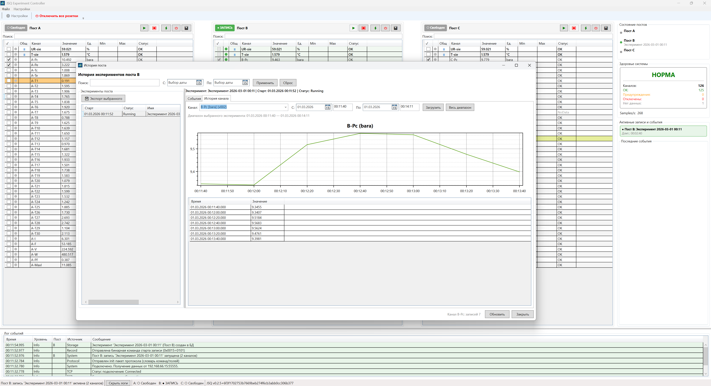

# JSQ Experiment Controller

[](https://dotnet.microsoft.com/en-us/download/dotnet-framework/net48)
[](https://learn.microsoft.com/en-us/dotnet/desktop/wpf/)
[](https://www.sqlite.org/)
[](https://xunit.net/)
[](CHANGELOG.md)

Desktop-приложение для промышленного мониторинга экспериментов в реальном времени. Захватывает двоичный поток данных по TCP от физического передатчика, декодирует 134 канала измерений, детектирует аномалии и надёжно сохраняет данные в SQLite с возможностью экспорта в legacy DBF-формат.

**Область применения:** испытательные стенды, климатические камеры, промышленные лаборатории — любые задачи, где нужна параллельная запись нескольких независимых экспериментов с контролем качества данных.

---

## Скриншоты

**Три независимых поста (A / B / C) с цветовой индикацией статусов каналов**


**Реалтайм-графики по каналам (OxyPlot) — открываются двойным кликом**


**История измерений эксперимента с агрегированным графиком**


---

## Ключевые возможности

- **Три независимых поста (A / B / C)** — параллельная запись экспериментов с раздельными базами данных и наборами каналов
- **Живой мониторинг каналов** — отображение значений, статусов, предупреждений и аварий в реальном времени
- **Гибкое распределение каналов** — drag-and-drop и мульти-выбор при назначении каналов по постам
- **Детектор аномалий** — обнаружение выходов за лимиты, дельта-скачков, таймаутов данных, ухудшения качества с дебаунсингом и гистерезисом
- **Надёжное хранение** — батч-запись в SQLite (агрегаты по 20-секундным окнам) через Dapper
- **Экспорт в legacy DBF** — атомарное формирование пакета (`.DAT`, `.INI`, `.DEF`, `.CAL`) для совместимости с устаревшим ПО
- **Автообновление по LAN** — фоновая проверка сетевой папки + SHA256 + применение на перезапуске без перезаписи БД

---

## Архитектура

Однонаправленный конвейер обработки данных с очередями:

```
Передатчик
    │ TCP-поток
    ▼
TcpCaptureService ──► IngestQueue ──► DecodeQueue ──► PersistQueue ──► SQLite
                        (байты)      (ChannelValue)   (агрегаты)
                                          │
                                     AnomalyDetector ──► Events
```

**Декомпозиция по модулям:**

| Модуль | Ответственность |
|--------|----------------|
| `JSQ.Core` | Доменные модели (`Experiment`, `Sample`, `ChannelDefinition`), контракты, конфигурация |
| `JSQ.Capture` | TCP-сокет, менеджмент соединения, три очереди producer-consumer |
| `JSQ.Decode` | Парсер бинарного протокола (`datiacquisiti`, 1132 байта, 134 канала, big-endian float64), маппинг индексов |
| `JSQ.Rules` | Детектор аномалий со стейт-машиной: Min/Max/DeltaSpike/NoData, дебаунсинг, гистерезис |
| `JSQ.Storage` | SQLite + Dapper, репозитории, батч-запись с flush-таймером |
| `JSQ.Export` | Формирование legacy DBF-пакета, атомарный экспорт через temp-директорию |
| `JSQ.UI.WPF` | WPF + MVVM (CommunityToolkit), реалтайм-таблицы каналов, OxyPlot-графики |
| `JSQ.Updater` | Отдельный процесс применения обновления (распаковка, перезапуск UI) |
| `JSQ.Tests` | Unit- и интеграционные тесты (xUnit) |

---

## Технический стек

| Категория | Технологии |
|-----------|-----------|
| **Платформа** | .NET Framework 4.8, C# (latest language features) |
| **UI** | WPF, MVVM, CommunityToolkit.Mvvm, OxyPlot.WPF |
| **Хранение данных** | SQLite, Dapper, Microsoft.Data.Sqlite |
| **Логирование** | Serilog (File + Debug sinks, ротация по дням) |
| **DI** | Microsoft.Extensions.DependencyInjection |
| **Тесты** | xUnit |
| **Сборка/релиз** | PowerShell-скрипт пакетирования, manifest.json, SHA256-верификация |

---

## Интересные инженерные решения

### Producer-Consumer конвейер
Три уровня очередей (`IngestQueue → DecodeQueue → PersistQueue`) полностью развязывают медленные операции (запись на диск) от высокочастотного приёма данных по TCP. Потеря одного пакета не блокирует поступление следующих.

### Стейт-машина детектора аномалий
Каждый канал имеет собственное состояние (Normal / Warning / Alarm / NoData). Переходы между состояниями защищены дебаунсингом — случайные выбросы не порождают ложные аварии. Восстановление фиксируется отдельным событием.

### Атомарный экспорт
Экспорт в DBF происходит через временную директорию: файлы собираются целиком и только потом перемещаются к целевому пути. Прерванный экспорт не оставляет частичных файлов.

### Безопасное автообновление
Пакет обновления проверяется по SHA256 до применения. Файлы БД (`*.db`, `*.db-wal`, `*.db-shm`) и пользовательские настройки (`main_grid_layout.json`, `app_settings.json`) никогда не перезаписываются.

### Маппинг 134 каналов
Передатчик отдаёт данные в порядке физических позиций. `ChannelRegistry` хранит пересчётную таблицу `позиция → логический индекс`, отделяя протокол от бизнес-логики.

---

## Быстрый старт

### Требования

- .NET SDK (для сборки) или .NET Framework 4.8 Runtime (для запуска)
- Windows 10 / 11

### Сборка и запуск

```bash
# Восстановление зависимостей
dotnet restore "JSQ/JSQ.slnx"

# Сборка
dotnet build "JSQ/JSQ.slnx" -c Release

# Запуск UI
dotnet run --project "JSQ/JSQ.UI.WPF/JSQ.UI.WPF.csproj"

# Тесты
dotnet test "JSQ/JSQ.Tests/JSQ.Tests.csproj"
```

### Конфигурация подключения

При первом запуске приложение создаёт `jsq.config.json` рядом с исполняемым файлом. IP-адрес и порт передатчика настраиваются через **Файл → Настройки** без перезапуска.

---

## Автообновление (LAN)

1. Приложение в фоне периодически проверяет сетевую папку (путь задаётся в Настройках).
2. Если найдена новая версия — скачивает пакет в `.jsq_updater/cache`, проверяет SHA256.
3. В блоке состояния системы появляется индикатор готового обновления.
4. На перезапуске `JSQ.Updater.exe` распаковывает пакет и перезапускает UI.

Формат `manifest.json` в feed-папке:

```json
{
  "Version": "0.2.5",
  "PackageFile": "update-0.2.5.zip",
  "Sha256": "<SHA256 архива>",
  "Size": 4704892,
  "Mandatory": false,
  "ReleaseNotes": "Описание изменений",
  "PublishedAt": "2026-02-28T12:00:00Z"
}
```

Вычислить хэш и размер:

```powershell
Get-FileHash "build\update_feed\stable\update-0.2.5.zip" -Algorithm SHA256
(Get-Item "build\update_feed\stable\update-0.2.5.zip").Length
```

> БД (`*.db`, `*.db-wal`, `*.db-shm`) и пользовательские настройки при обновлении **не перезаписываются**.

---

## Структура репозитория

```
JSQ-recorder/
├── JSQ/
│   ├── JSQ.slnx               # Solution
│   ├── JSQ.Core/              # Доменные модели и конфигурация
│   ├── JSQ.Capture/           # TCP-захват, очереди
│   ├── JSQ.Decode/            # Декодер бинарного протокола
│   ├── JSQ.Storage/           # SQLite + Dapper
│   ├── JSQ.Rules/             # Детектор аномалий
│   ├── JSQ.Export/            # Legacy DBF-экспорт
│   ├── JSQ.UI.WPF/            # WPF-приложение (MVVM)
│   ├── JSQ.Updater/           # Процесс обновления
│   └── JSQ.Tests/             # xUnit тесты
├── docs/
│   └── screenshots/           # Скриншоты UI
└── make_release.ps1           # Скрипт сборки релизного пакета
```
